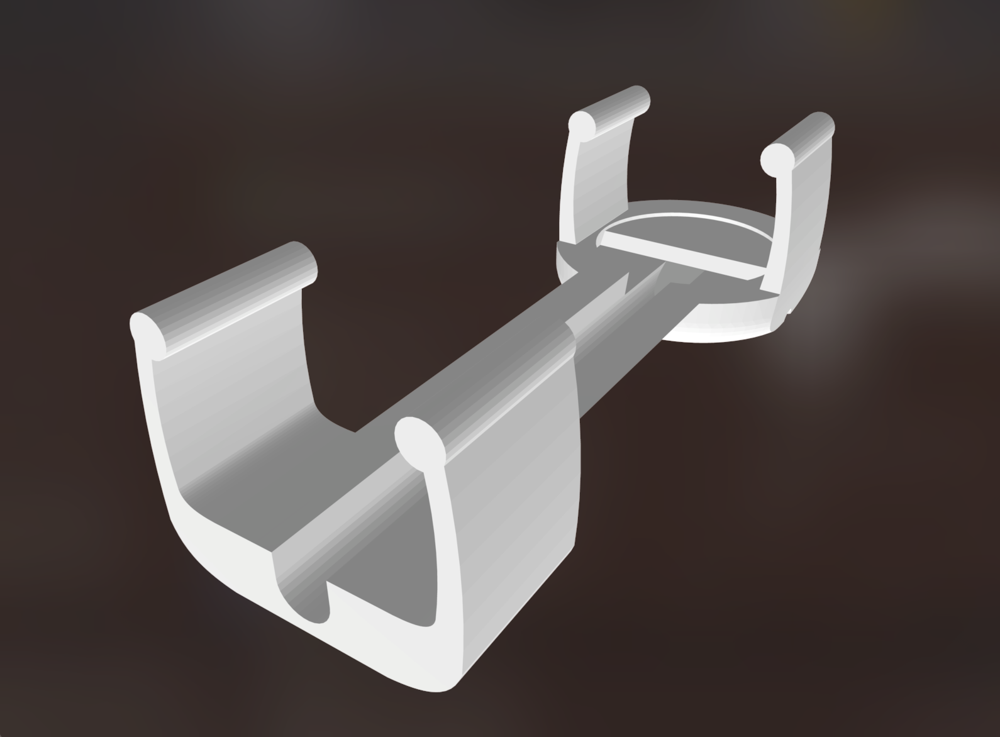
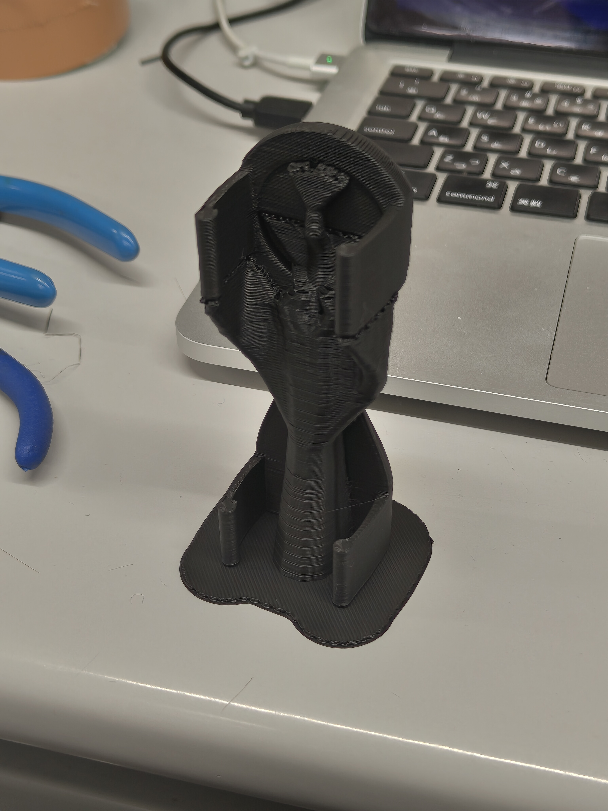

# 特製コンタクトマイクロフォン(振動センサー)の制作手順

## 材料・道具

- ピエゾ素子（圧電サウンダ） 直径27mmのもの リード線付き
    - [村田製作所](https://akizukidenshi.com/catalog/g/g113209/)のものなど。
- 2芯シールドケーブル 直径4mm 1つあたり2m程度
    - [CANARE GS4](https://www.soundhouse.co.jp/products/detail/item/167365/)
- 3.5mmステレオミニプラグ
    - [CANARE F12S](https://www.soundhouse.co.jp/products/detail/item/310266/)
- 熱収縮チューブ 収縮前内径4.5mm 収縮後2mmのもの
- グルーガン
- はんだごて・はんだ
- ヒートガン

## 制作手順

### ケーブルの被覆を剥く

### プラグをはんだ付けする

### 熱収縮チューブを通す

### ピエゾ素子をはんだ付けする

## トーンチャイム用アタッチメントの印刷（省略可）

トーンチャイムへのセンサーの装着は、ひっつき虫でも問題なく行えます。

オプションとして、ケーブルのはんだ付け部の保護や取り付けやすさのために、3Dプリンタで印刷可能なアタッチメントを制作しました。

トーンチャイムは音程によって太さが2種類あるため、モデルデータも大小用意しています。

- 大径用
    - `piezo_cover_large.stl`
    - `cableclip_large.stl`
- 小径用
    - `piezo_cover_small.stl`
    - `cableclip_small.stl`

3Dプリントで出力する際には、以下の画像のように縦向きにしてピエゾを取り付ける円盤部分が上になるように印刷してください。寝かせて印刷すると積層の方向的に、トーンチャイムにはめる際に割れる可能性があります。

`cableclip`のモデルは、必要に応じてケーブルを端で留める際に使用してください。

