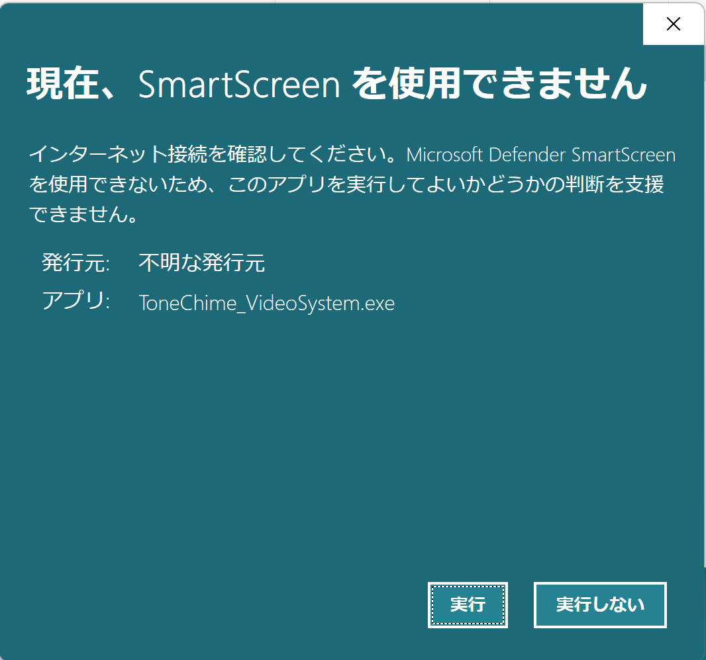
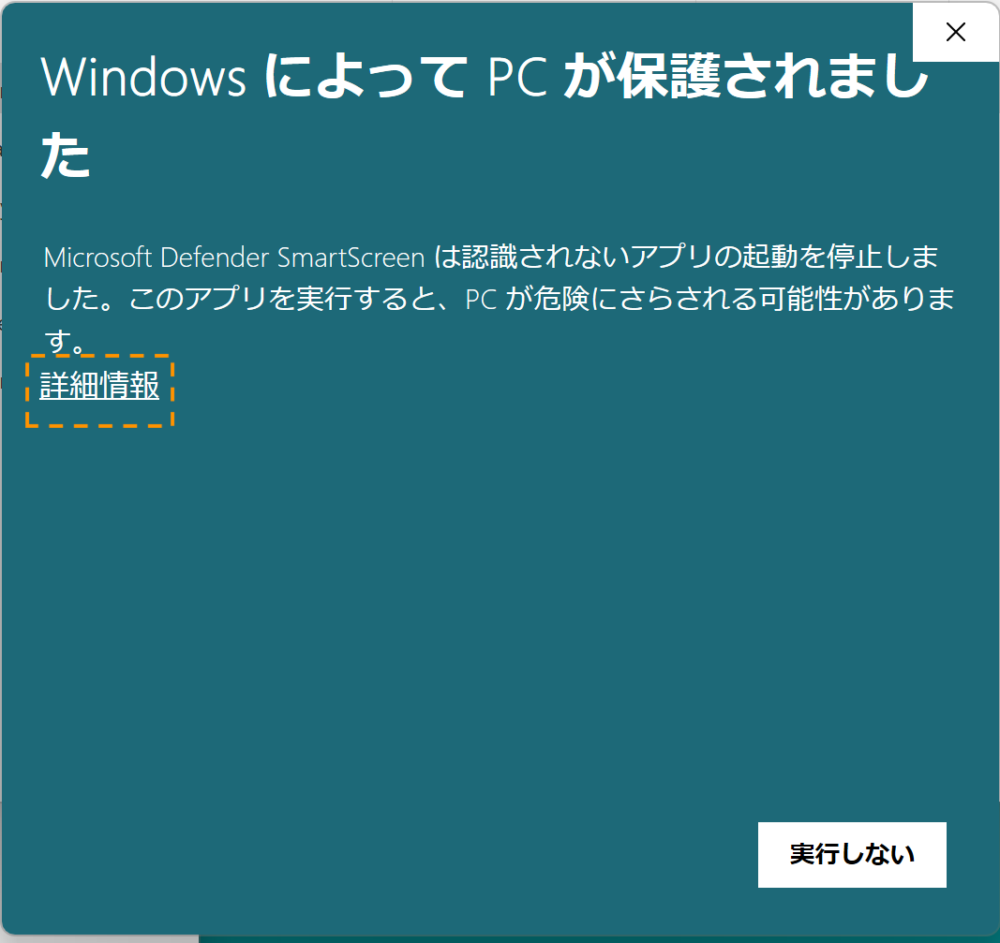

# トラブルシューティング

## アプリケーションの起動がブロックされる

WindowsでもmacOSでも、アプリケーションをダウンロードしてから初回の起動時はセキュリティにより起動をブロックされます。

Windowsの場合、インターネットに接続されていなければ、「現在、SmartScreenを実行できません」というダイアログが出てきます。この場合は「実行する」をクリックすると起動します。

インターネットに接続されている場合、「WindowsによってPCが保護されました」というダイアログが出ますが、「詳細情報」をクリックすると、「実行」のボタンが現れるので、そこから起動できます。

macOSの場合、Finderやデスクトップ上で、アプリケーションのファイルをダブルクリックでなく右クリックのメニューから「開く」を選択して起動してください。この方法で、ダイアログに起動するのオプションが現れます。

Windowsでも、macOSでも、一度起動した後は通常のアプリケーションと同じように起動することが可能です。

## 音アプリケーションが起動しない

## 音アプリケーションが反応していない

## 音の情報が照明に反映されない

## 音の情報が映像に反映されない

音アプリケーションの「Device Communication」で以下の事項を確認してください。

- `LOCAL_MODE`のボタンは黄色になっていますか？なっていなければクリックしてください。
- 右下にある"port"の数字が、映像アプリケーションのportの数字と同じか確認してみてください。
    - デフォルトでは通信ポートは8888となっていますが、他のアプリケーションとポートが競合している可能性があります。8000番以降の番号で適当な数字をいくつか試してみてください。
- OSのファイアウォール設定により、アプリケーション間の通信をうまく行えないことがあります。
    - 必要に応じて、一時的にファイアウォール設定をオフにしてください。（インターネットに接続している場合などは、セキュリティ上のリスクがあることに注意してください。）